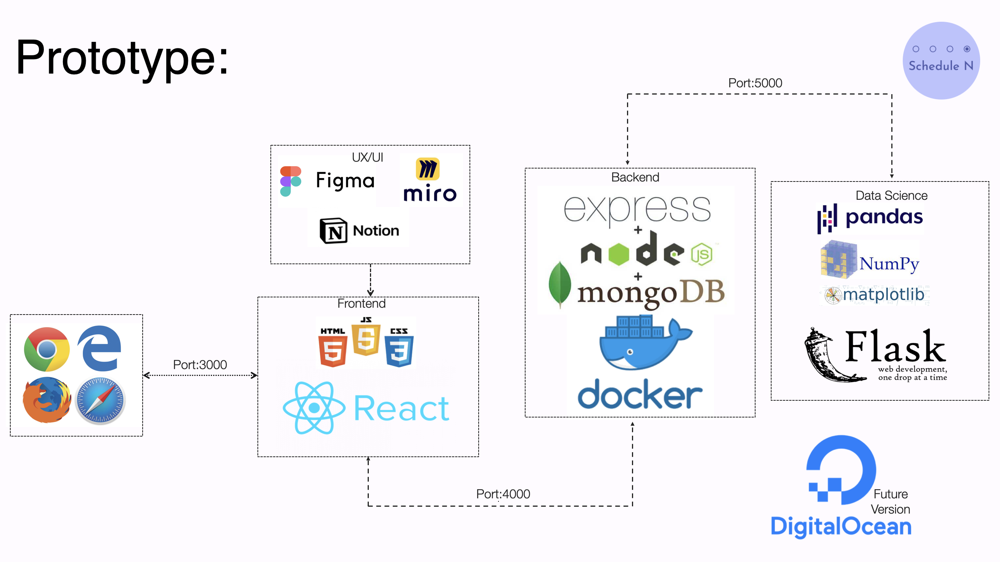
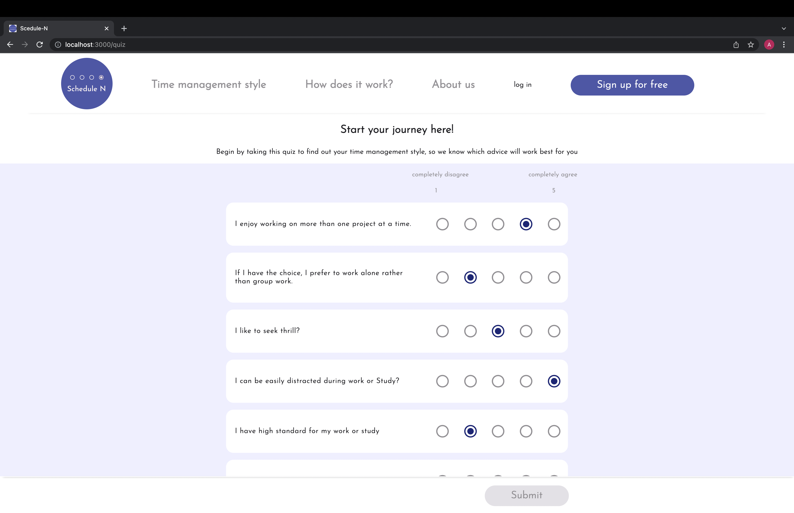

# Schedule N - blog post

### **Project Brief:**

Schedule N created a website to empower users to receive personalised advice for managing their time based on their personality.

### **Introduction:**

With Schedule N we try to help people in need get personalised advice regarding time management. Our target group are the people who have trouble managing their time. Most of them have used several apps or tried many online suggestions, but most of the apps or tips  didn’t work for them. We believe that is because these solutions are so general. Our product tries to solve this problem by providing users with more specific advice based on their personality, their current working status and their aim for time management.

### **Solution:**

**We as developers:**

1. Classify people into different time management (TM) styles 
2. Match time management advice with different TM styles

**Users:** 

1. Take a quiz on our website
2. Find out about their TM style
3. Learn about their TM type and receive advice matched for their own type

**Versions:** 

In version 1 (current version) users can learn about their TM style and get some advice specific for their TM type. 

In version 2 we will provide users with more advice from real people who have the same TM type as them.

**Mision:**

Our mission is to help people improve their knowledge about themselves regarding time management to be more productive and use their time better in line with their personality and situation.

## Time based development progress


## Track based development progress

### All tracks together

**Ideation** 

At the beginning of the project, we had ideation session together to clarify the goal of our product, research on competitive products on the market, and determined our solution to the problem. Part of the research and ideation can be found on our [*miro page*](https://miro.com/app/board/uXjVOeApc9Y=/).

Together, we decided that we will build a website, on which users will take a quiz, and we can categorise them into different time management types based on their answers. They will also share their personal experience of useful/useless TM methods for him/her, so that we can inform users about useful/useless TM advice of their own type.

**Questionnaire design**

The next question for us was how to find or design such a questionnaire. We found some existing questionnaires on market, but they all aim to categorise people based on their time management ability instead of preference or personality. Therefore, we decided to design our own questionnaire based on an online resource of six time management personality types:

- [*Hopper*](https://www.haikudeck.com/hopper-time-management-personality-style-business-presentation-21ef11736d)
- [*Perfectionist*](https://www.haikudeck.com/perfectionist-plus-time-management-style-business-presentation-4f0ca9ed71)
- [*Impulsive*](https://www.haikudeck.com/impulsive-time-management-style-business-presentation-81897d6344)
- [*Cliff hanger*](https://www.haikudeck.com/cliff-hanger-time-management-style-business-presentation-2675d59395)
- [*Big picture*](https://www.haikudeck.com/big-picture-time-management-style-business-presentation-d498fcbc7d)
- [*Hyperfocus*](https://www.haikudeck.com/hyper-focus-time-management-style-business-presentation-9d45166096)

The questionnaire was designed based on the 4 to 6 descriptions of each time management personality. We removed some repetitive descriptions between types, and created a quiz with 24 statements. Users will rate how well the statement describes themselves and choose a response from ‘completely disagree’, ‘I disagree’, ‘neutral’, ‘I agree’ and ‘completely agree’. To avoid that users might recognise a pattern from the quiz and bias the result, the order of the 24 statements were scrambled so that statements of the same TM type are not placed together, and some statement was negated. 

- The final version of our questionnaire can be found here: TM_questionnaire.txt
- The question-type matching can be found here: TM_question_type_match.txt

**Data collection**

Our initial dataset was collected via Google forms. [*Dataset 1*](https://github.com/TechLabs-Berlin/wt21-schedule-n/blob/xinhao_branch/TM_result.csv) and [*dataset 2*](https://github.com/TechLabs-Berlin/wt21-schedule-n/blob/xinhao_branch/TM_result_2nd.csv) was collected in two rounds and later used in data analysis.

### **UX Track**
**Introduction**

In this project UX track worked based on a design thinking process. Working in line with a design thinking approach helped us to keep iteration in our work flows. As a first step we tried to reach mutual understanding about the problem that we wanted to solve and then started our work with research. The UX track activities include these main parts: discovery research, define, ideate and prototype. In the whole work we tried to be focused on user needs and asked ourselves why we need to add or not add a feature. So we tried to consider the data-driven approach too. You can find the details about the process in this links: 

- [Schedule-N / UX Track](https://puzzled-musician-415.notion.site/Schedule-N-UX-Track-029902cd6fd840d78712faf738d72d9f)

On this Notion you will read:

**Discovery Research**  
1. [Competitive Analytics](https://puzzled-musician-415.notion.site/Schedule-N-UX-Track-029902cd6fd840d78712faf738d72d9f#0e4d89fa7b054794b39bafa4047e57dd)  
2. [User Research](https://puzzled-musician-415.notion.site/Schedule-N-UX-Track-029902cd6fd840d78712faf738d72d9f#ebaa7fa9382249bb94f7e039e662fdbb) 
3. [Formative Research](https://puzzled-musician-415.notion.site/Schedule-N-UX-Track-029902cd6fd840d78712faf738d72d9f#9dfcd19c056f4e2caca8e737c3af6027)  
4. Sample of what we have done during this steps.  

**Define**
1. [Affinity Diagram and User Persona](https://puzzled-musician-415.notion.site/Schedule-N-UX-Track-029902cd6fd840d78712faf738d72d9f#7f4ea22cc0174d1ca1cb5f93b6429caa)
2. [Problem Statement (POV)](https://puzzled-musician-415.notion.site/Schedule-N-UX-Track-029902cd6fd840d78712faf738d72d9f#5fe3b2df862c4755b66afe9660e8b9c6)
3. [User Stories](https://puzzled-musician-415.notion.site/Schedule-N-UX-Track-029902cd6fd840d78712faf738d72d9f#de43d88a69184683b7551c55dc43ca92) 
4. Business Goal

**Ideate**  
1. [Solutions](https://puzzled-musician-415.notion.site/Schedule-N-UX-Track-029902cd6fd840d78712faf738d72d9f#c5a2df3305364eeeb7ed1ddcbf9551b1)  
2. [Features and Requirements](https://puzzled-musician-415.notion.site/Schedule-N-UX-Track-029902cd6fd840d78712faf738d72d9f#4d2cf7a4fe5b4c619d9448bac9ce1b40)  
3. [Limitations](https://puzzled-musician-415.notion.site/Schedule-N-UX-Track-029902cd6fd840d78712faf738d72d9f#e78c7e210c344336813c4da8503ac0d5)  
4. [Decision Path](https://puzzled-musician-415.notion.site/Schedule-N-UX-Track-029902cd6fd840d78712faf738d72d9f#27164a531d8b41bd8ff14709aae53afb)  
5. [Content Strategies](https://puzzled-musician-415.notion.site/Schedule-N-UX-Track-029902cd6fd840d78712faf738d72d9f#495a445ffe874c8f98d65498e57f4410)  
6. [Task Flows (UX Flows)](https://puzzled-musician-415.notion.site/Schedule-N-UX-Track-029902cd6fd840d78712faf738d72d9f#225f0e2914bf40afbc0301b5ee4a5962)  
7. [Site Map (Overview)](https://puzzled-musician-415.notion.site/Schedule-N-UX-Track-029902cd6fd840d78712faf738d72d9f#acdeb4f2f91c416b931b64ae4aaaefc5)  

**Prototype**
1. [Wireframing](https://puzzled-musician-415.notion.site/Schedule-N-UX-Track-029902cd6fd840d78712faf738d72d9f#709665d71b234cbc8b33e88130006589)  
2. [Usability Testing](https://puzzled-musician-415.notion.site/Schedule-N-UX-Track-029902cd6fd840d78712faf738d72d9f#2d094b94ac4d49f2a24fbf4ee365150d)  
3. [UI Style Guide](https://puzzled-musician-415.notion.site/Schedule-N-UX-Track-029902cd6fd840d78712faf738d72d9f#2d094b94ac4d49f2a24fbf4ee365150d)  
4. [Prototyping](https://puzzled-musician-415.notion.site/Schedule-N-UX-Track-029902cd6fd840d78712faf738d72d9f#2d094b94ac4d49f2a24fbf4ee365150d) 
5. [Reasoning and explanations](https://www.notion.so/Reasoning-and-explanations-de1f204b3d1140218a80a1316a56a733)

**UX Successes, Challanges, and Learnings**

1. **Success**

- Working together as a UX team despite working completely opposite work schedules!
- Learning to work together with different levels with tech abilities
- Sharing ideas and numerous iteration via Miro, communications via Slack and Figma.
- Our final designs were tested with users and received positive feedback, minor or no changes were required!

2. **Challenges**

- Jumping in at the deep end after the academic phase! Having to apply the theory to reality was an adjustment for us all.
- Understanding the capabilities of the other tracks and the responsibilities of the individual teams
- Timeline of doing research vs needing to create wireframes for the WD team- difficult to get the in depth user research completed that we would have liked to
- Clare contracting Corona virus meant that the initial wireframes decisions were left for Saba to navigate on her own- she had to keep the project moving by herself during a really busy time, thanks to her efforts the WD got what they needed!

3. **Learnings**

- Getting as much user feedback early as possible will save you time! And it doesn’t have to be perfect before you show them designs
- We now have a good understanding of the other tracks roles within the project and what they do/don’t require from us
- Figma skills have improved

### **DS Track**

You can find the details of the code in [Schedule-N / DS Track](https://www.notion.so/Schedule-N-DS-Track-ceae7706f14e439a9c1b76968e6fb256)

**1st stage: Data analysis**

In this stage two algorithms were written to:

1. Convert individual user’s quiz answers into time management (TM) types
2. Investigate the distribution of TM types in the user group

**2nd stage: Connect to backend**

In this stage the quiz-type conversion function was adjusted to match the requirement of backend. Four changes were made to the function: 

1. The output of the function was changed from string to a dictionary object, so that it can be directly accessed as a json object from backend

```python
#%% save TM type of user as a dictionary object  
    user_TM_type = {
            'TM_type': type_num_data['winner_type'][0]
            }
    return user_TM_type
```

1. The input of the function was changed from a .json file to a Json object, as user data is sent to backend in the format of Json object instead of .json file

```python
#%% load data
    # convert dictionary to DataFrame
    df = pd.DataFrame([user_answers])
```

1. Based on the requirement of the backend, the keys of the json object should not contain hyphen ‘-’, thus, the data cleaning function in DS script was changed accordingly

```python
#%% define data cleaning function
    def text_to_score(a):
         if a == "completelyDisagree":
             return 1
         elif a == "IDisagree":
             return 2
         elif a == "IAgree":
             return 3
         elif a == "completelyAgree":
             return 4   
#%% data cleaning          
    type_num_data = type_data.applymap(text_to_score)
```

1. Based on the feedback from user test, UX track suggested changing response key of quiz from  4-option to 5-option, adding the option of ‘neutral’ when user doesn’t have any preference. Following the changes of the quiz format, quiz-type conversion function was changed accordingly:
- The score of each question was changed from 1-4 to 1-5

```python
#%% define data cleaning function
    def text_to_score(a):
         if a == "completelyDisagree":
             return 1
         elif a == "IDisagree":
             return 2
				 elif a == "neutral":
						 return 3
         elif a == "IAgree":
             return 4
         elif a == "completelyAgree":
             return 5   
#%% data cleaning          
    type_num_data = type_data.applymap(text_to_score)
```

- The conversion function was changed accordingly:

```python
#%% calculate the average score for each type (23 question FINAL version)
    # hooper        = (Q1 + Q4 + Q6 + Q14 + Q16 + (6 - Q19)) / 6 - 3
    # Perfectionist = (Q2 + Q5 + Q7 + Q9 + Q15 + (6 - Q17)) / 6 - 3
    # cliff_hanger  = (Q12 + Q20 + Q21 + Q22 + (6 - Q8)) / 5 - 3
    # impulsive     = (Q3 + Q4 + Q16 + Q18 + (6 - Q10)) / 5 - 3
    # big_idea      = (Q11 + Q21 + Q23 + (6 - Q7)) / 4 - 3
    # hyperfocus    = (Q7 + Q13 + Q24 + (6 - Q1) + (6 - Q6)) / 5 - 3
```

The current version of the script called by website can be found in [this Github repository](https://github.com/TechLabs-Berlin/wt21-schedule-n/blob/xinhao_branch/get_TM_type_5_option.py): 

**Next steps:**

The future development directions of DS include the following:

1. **Debugging**
    
    The current function return one TM type with the highest score as the user’s type, which may run into error when user have the same score for more than one TM type. The future version of script should solve this issue.
    
2. **Personal advice data sorting** 
    
    We have collected user’s personal advice about useful/useless TM advice for their own type, and would like to recommend their personal experience-based TM advice in future version. To achieve this, the future version of script should analyse the collected personal advice, extract the key words, and sort them based on frequency for recommendation.
    
3. **More features for type matching**
    
    The current function for TM type conversion only includes the feature of forced alternative choice. In the future version we would like to include user’s job status and goal of time management for their TM advice recommendation. 
    

### **WD Track**

**Tech Stack**

***Backend***:

- MongoDB - Database for users and datasets
- Flask - Processing and serving dataset
- Express JS - Serving JSON data, static files, and route to flask end point
- Axios

***Frontend***:

- HTML
- CSS
- JavaScript
- React
- Axios



#### Frontend

The wire frame was created with [React](https://create-react-app.dev/) for a web application. The main functionality is the user quiz to define the time management style. Since there is to handle 27 questions in the form and also in the beginning of the project there was the idea to implement even more with more general personality quiz, the [React Hook Form](https://react-hook-form.com/) hook was imported to make the handling easier and adjustments quicker. This hook is also be used for the user accounts, but it couldn't be finished in time till deadline (covid cases in the backend and frontend part). The backend part of the user accounts is almost ready, except for the implementation of the password. Instead, there was the attempt to use the birthday instead. For future development the API has to be implemented in the frontend and with this several toggle effects for logged-in users, which can be seen in the Figma files. 

For the result component, the [React Minimal Pie Chart](https://www.npmjs.com/package/react-minimal-pie-chart) was used to display the statistics of the user type. Some styling issues couldn't be solved within time, since a line break of the label wouldn't take some more time to adjust and other label styling for the shift have to be discussed with the UX team (small percentages of types make the visibility of labelling more difficult). This library allows build in usage off various effects, which will be helpful for displaying the information on other types for the user.

The installation of [React Router](https://reactrouter.com) to the frame was made to handle navigation. The first user feedback was partly included in the prototype. The footer was removed, and the header was consistent to all components. The use of React Router is now less used with the amount of components since we have modals, but might be more needed for future development. 

The application runs best with Google Chrome as browser, there is might occur styling issues for the login/signup page in other browser. It has to be figured out if an external library to normalise the behaviour of the browser is better or individual appearance adjustments in the CSS files.

There are plans for usage of more semantic tags and web accessibility. In addition, the code for the radio button questions can be shortened by mapping over an array of the questions, but due to lack of time this will be done in future versions.




#### Backend
Nodejs, express, and Mongodb were used to build the backend. The backend also worked on setting up a flask server so that we could connect to the Data Science's phyton script. After the user submits the query, the backend sends a request to the python script, which provides the Time-management type to the backend based on the options selected. The backend then sends the answer to the front end to present to the users.
The backend also used Docker to improve team collaboration by minimizing dependencies setup time.
